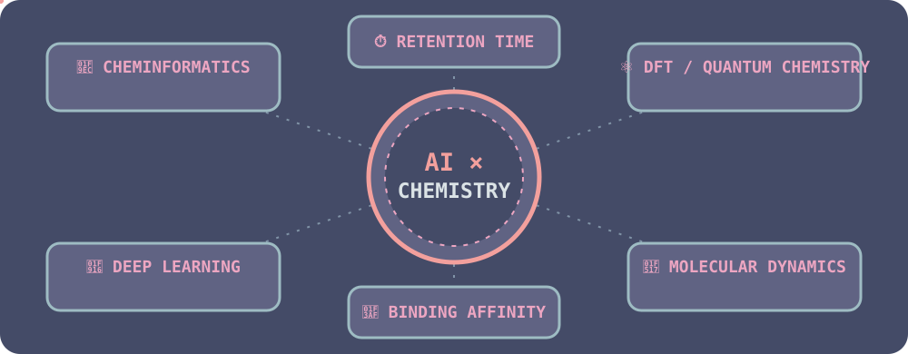

  
  
  

<i>Postdoctoral Research Fellow · Pukyong National University · Busan, South Korea</i>

## Research workflow

  

## What I work on

  

## Selected work

<table>
<tr>
<td width="33%" valign="top">

### 01 · [RT-TR](https://github.com/SargolMazraedoost/RT-TR)

**PREDICT**

`SMILES` → `retention time`

Hybrid Transformer–BiLSTM modeling for direct molecular prediction.

**Result:** MAE 26.97 s · MAPE 3.35% · R² 0.90

`Python` `PyTorch` `Open Source`

</td>
<td width="33%" valign="top">

### 02 · [Cross-column QSRR](https://doi.org/10.1007/s00216-024-05243-7)

**TRANSFER**

`DFT descriptors` → `transferable models`

Machine learning across chromatographic columns and conditions.

**Result:** a physics-informed route to cross-system prediction.

`DFT` `QSRR` `Machine Learning`

</td>
<td width="33%" valign="top">

### 03 · [MBD2–p66α](https://doi.org/10.1002/bkcs.12923)

**DESIGN**

`Mutations` → `interaction strength`

An integrative pipeline for computational protein design.

**Result:** prioritized stabilizing mutations for a protein–protein interface.

`MD` `Free Energy` `Protein Design`

</td>
</tr>
</table>

<b>Publications</b>

1. **Cross-Column Density Functional Theory-Based QSRR Model Development Powered by Machine Learning** — *Analytical and Bioanalytical Chemistry* (2024) · [DOI](https://doi.org/10.1007/s00216-024-05243-7)
2. **Integrative Computational Pipeline for Identifying Binding-Enhancing Mutations Targeting the MBD2–p66α Interaction** — *Bulletin of the Korean Chemical Society* (2025) · [DOI](https://doi.org/10.1002/bkcs.12923)
3. **Prediction of Chromatographic Retention Time Using a Hybrid Transformer–LSTM Model** — *Journal of Chemical Information and Modeling* (2025) · [DOI](https://doi.org/10.1021/acs.jcim.5c00167) · [Code](https://github.com/SargolMazraedoost/RT-TR)

<b>Background, awards, and languages</b>

### Education

- **Ph.D. in Chemical Convergence Engineering**, Pukyong National University (2021–2025)
- **M.Sc. in Microbiology**, Islamic Azad University of Lahijan (2017–2019)
- **B.Sc. in Cell and Molecular Biology**, Islamic Azad University of Lahijan (2013–2017)

### Awards

- Outstanding International Student Award **자랑스러운 국립 부경대학교 외국인 유학생**, Pukyong National University, August 20, 2025.
- Recipient of **3 Presentation Awards at KIChE (2022–2024)** for research on ML/DL-based chromatographic modeling.

### Conferences

Presentations at:

- Korean Chemical Society (KCS)
- Korean Institute of Chemical Engineers (KIChE)
- Korean Society for Biotechnology and Bioengineering (KSBB)
- Korean Society for Microbiology and Biotechnology (KMB)
- Korean Peptide and Protein Society (KPPS)

**Period:** 2022–2025

### Languages

🗣️ **Persian** — Native&nbsp;&nbsp;&nbsp;
 **English** — Professional&nbsp;&nbsp;&nbsp;
 **Korean** — Elementary

 

 

### Let’s connect

  &nbsp;
  &nbsp;
  &nbsp;
  &nbsp;
  

📧 [sargol@pknu.ac.kr](mailto:sargol@pknu.ac.kr) · [sargol.mazraedoost7@gmail.com](mailto:sargol.mazraedoost7@gmail.com)

