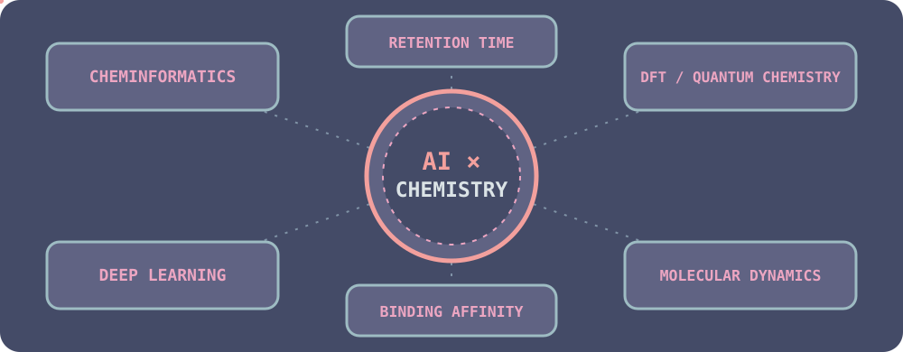

<i>Full-Time Research Professor (전임연구교수) · Pukyong National University · Busan, South Korea</i>

<b>AI-driven cheminformatics and bioinformatics for molecular prediction, modeling, and discovery.</b>

## About Me

I am a **Full-Time Research Professor (전임연구교수)** in South Korea with a **Ph.D. in Chemical Convergence Engineering** from Pukyong National University.

My research focuses on **AI-driven cheminformatics and bioinformatics**, integrating **density functional theory (DFT), machine learning, and deep learning** for QSRR and QSAR modeling, together with **molecular docking and molecular dynamics simulations** for investigating protein–protein and protein–ligand interactions.

My broader goal is to combine **molecular information, physical chemistry, and artificial intelligence** to build predictive and interpretable computational models for chemical and biological systems.

## Research Workflow

## What I Work On

### Research Areas

*  **Artificial Intelligence for Molecular Sciences**
*  **Cheminformatics & Molecular Informatics**
*  **Bioinformatics & Computational Biology**
*  **Machine Learning & Deep Learning**
*  **Density Functional Theory (DFT)**
*  **QSAR / QSPR / QSRR Modeling**
*  **Chromatographic Retention Time Prediction**
*  **Molecular Docking**
*  **Molecular Dynamics Simulations**
*  **Protein–Protein Interactions**
*  **Protein–Ligand Interactions**

## Selected Work

<table>
<tr>
<td width="33%" valign="top">

### 01 · [RT-TR](https://github.com/SargolMazraedoost/RT-TR)

**PREDICT**

`SMILES` → `retention time`

A hybrid Transformer–BiLSTM framework for direct chromatographic retention-time prediction from molecular structure.

**Result:** MAE 26.97 s · MAPE 3.35% · R² 0.90

`Python` `PyTorch` `SMILES` `Deep Learning`

</td>

<td width="33%" valign="top">

### 02 · [Cross-Column QSRR](https://doi.org/10.1007/s00216-024-05243-7)

**TRANSFER**

`DFT descriptors` → `cross-column prediction`

A DFT-powered machine-learning framework for transferable chromatographic retention modeling across different column systems.

**Focus:** integrating quantum-chemical descriptors with machine learning for cross-system QSRR prediction.

`DFT` `QSRR` `Machine Learning`

</td>

<td width="33%" valign="top">

### 03 · [MBD2–p66α](https://doi.org/10.1002/bkcs.12923)

**DESIGN**

`Mutations` → `binding enhancement`

An integrative computational pipeline for identifying mutations that enhance the MBD2–p66α protein–protein interaction.

**Focus:** structure-based analysis, molecular simulation, and binding-energy evaluation.

`Molecular Dynamics` `Free Energy` `Protein Design`

</td>
</tr>
</table>

## Current Research Directions

My current computational work extends across several areas of molecular AI and modeling:

**Molecular Representation Learning**
Exploring molecular fingerprints, graph neural networks, molecular language models, and 3D structure-aware representations for chemical property prediction.

**Molecular Docking & Dynamics**
Using docking, molecular dynamics simulations, and energetic analyses to investigate ligand–protein and protein–protein interactions.

**Quantum Chemistry & Molecular Properties**
Integrating DFT-derived molecular descriptors and physicochemical information with statistical and machine-learning models.

**Chromatographic Modeling**
Developing transferable QSRR and deep-learning approaches for predicting chromatographic retention behavior directly from molecular information.

## Selected Publications

<b>View publications</b>

 

For the most up-to-date list of publications, please visit my [Google Scholar profile](https://scholar.google.com/citations?user=tosxQUIAAAAJ&hl=en).

### 2025

**Prediction of Chromatographic Retention Time Using a Hybrid Transformer–LSTM Model**
*Journal of Chemical Information and Modeling*
[DOI](https://doi.org/10.1021/acs.jcim.5c00167) · [Code](https://github.com/SargolMazraedoost/RT-TR)

**Integrative Computational Pipeline for Identifying Binding-Enhancing Mutations Targeting the MBD2–p66α Interaction: Implications for Therapeutic Applications**
*Bulletin of the Korean Chemical Society*
[DOI](https://doi.org/10.1002/bkcs.12923)

### 2024

**Cross-Column Density Functional Theory-Based QSRR Model Development Powered by Machine Learning**
*Analytical and Bioanalytical Chemistry*
[DOI](https://doi.org/10.1007/s00216-024-05243-7)

 

## Academic Background

<b>Appointments, education, awards, conferences, and languages</b>

 

### Academic Appointments

**Full-Time Research Professor (전임연구교수)**
AI-Driven Cheminformatics and Bioinformatics
Pukyong National University · Busan, South Korea
**Sep 2026–Present**

**Postdoctoral Research Fellow**
AI-Driven Cheminformatics and Bioinformatics
Pukyong National University · Busan, South Korea
**Sep 2025–Aug 2026**

### Education

**Ph.D. in Chemical Convergence Engineering**
Pukyong National University · South Korea
**2021–2025**

**M.Sc. in Microbiology**
Islamic Azad University of Lahijan · Iran
**2017–2019**

**B.Sc. in Cell and Molecular Biology**
Islamic Azad University of Lahijan · Iran
**2013–2017**

### Awards

**Outstanding International Student Award**
자랑스러운 국립 부경대학교 외국인 유학생
Pukyong National University · August 20, 2025

**Three Presentation Awards — KIChE**
Korean Institute of Chemical Engineers · **2022–2024**

Recognized for research involving machine-learning and deep-learning approaches to chromatographic modeling.

### Conferences

Research presented at:

* **KCS** — Korean Chemical Society
* **KIChE** — Korean Institute of Chemical Engineers
* **KSBB** — Korean Society for Biotechnology and Bioengineering
* **KMB** — Korean Society for Microbiology and Biotechnology
* **KPPS** — Korean Peptide and Protein Society

**Presentation period:** 2022–2025

### Languages

**Persian** — Native

**English** — Professional

**Korean** — Elementary

 

## Computational Toolkit

  

 

## Connect

&nbsp;

&nbsp;

&nbsp;

&nbsp;

📧 [sargol@pknu.ac.kr]()
📧 [sargol.mazraedoost7@gmail.com]()
